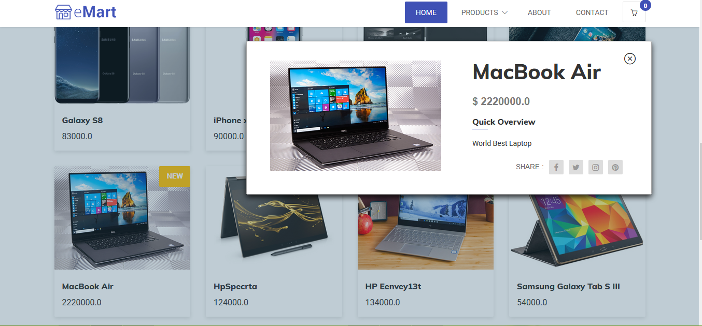
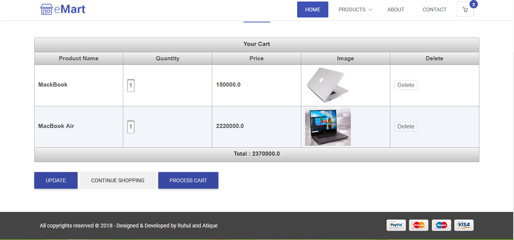

<h2>Project Name: Online Shopping</h2>

<h3>Development Tools &Technologies</h3>
<ul>
  <li>Hibernate </li>
  <li>JSF</li>
  <li>PrimeFace</li>
  <li>Bootstrap</li>
  <li>AJAX</li>
</ul>

<h3>Database</h3>
<ul>
  <li>MySQL</li>
</ul>

<h3>Using IDE for project development</h3>
 NetBeans IDE 8.2

<h3>Project Features</h3>
<ul>
  <li>Add category </li>
  <li>Add sub-category </li>
  <li>Add product</li>
  <li>User can view product</li>
  <li>Add product to cart</li>
  <li>Edit product in cart</li>
  <li>Application can calculate total price</li>
</ul>

<h2>Home Page</h2>

<h2>Featured Products</h2>

<h2>View Product</h2>

<h2>Add Product to Cart</h2>

